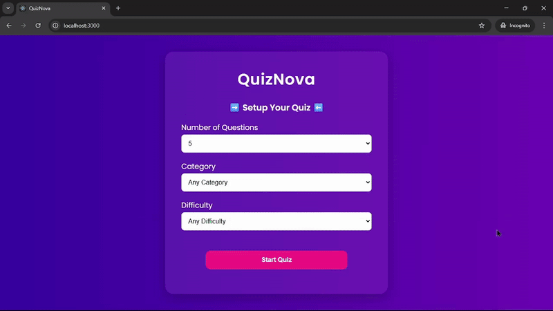

# 🧠 Quiz Nova

**Quiz Nova** is a dynamic quiz app built with **React fundamentals** — including components, props, state, and effects.

Users can configure their own quiz by selecting the **number of questions**, **category**, and **difficulty**, and the app will fetch randomized questions from the **[Open Trivia DB API](https://opentdb.com/)**.

This project was built during my early React learning phase — before I explored tools like Context or Redux. As a result, you may notice some prop drilling in the code, which I plan to refactor in the future.

## 🎥 Demo

---

## ✨ Tech Stack

- React (Core fundamentals: components, props, state, effects)
- Fetch API
- Open Trivia DB API
- Vanilla CSS

---

## 🛠️ Features

- Quiz configuration (num of questions, category, difficulty)
- Dynamic data fetching from Open Trivia DB API
- Basic layout with vanilla CSS
- Displays one question at a time with interactive answers
- Shows score and correct answers at the end of the quiz

---

## 🚧 Future Improvements

- Refactor the app to **TypeScript**
- Use **Context API** to reduce prop drilling
- Make the design fully **responsive** for smaller devices
- Improve **code structure** and readability
- Optionally persist quiz results with localStorage or backend
